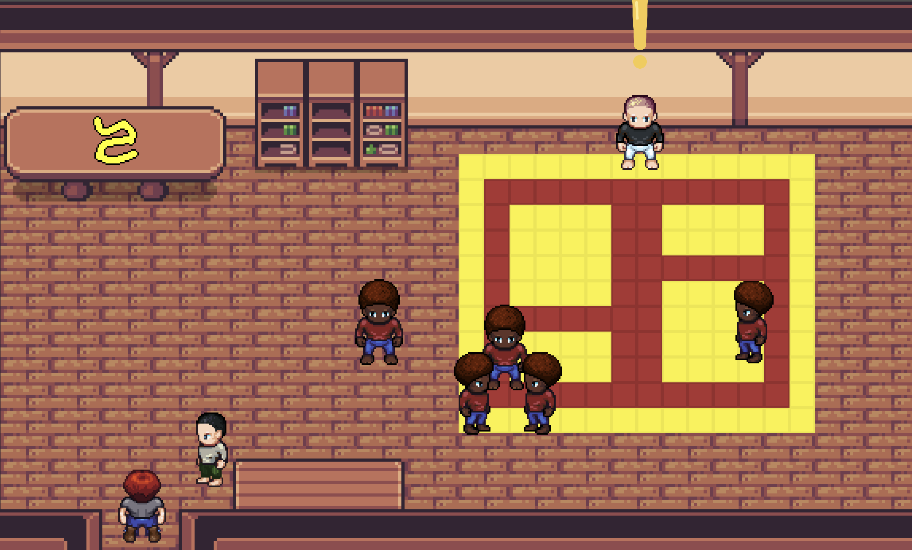

# MAJ23-T3-A : Développement d'un serious game

Le sujet du jeu est  : Sous les premières apparences du palimpseste jiu-jistique : resituer le(s) sens de la violence au travers de l’ethnographie TW : Violence.

Ce jeu consiste à enquêter sur diverses affaires de violences dans des contextes divers et variés rendant attentif le joueur que la violence n’est pas à prendre de la même façon selon la situation.

## Pour commencer

### Quelques images du jeu

### Documentation

Vous trouverez dans ce [document](Description.md) la description de notre projet T3.

### Pré-requis

Assurez-vous d'avoir un ordinateur sous Linux, MacOs ou Windows 7 ou supérieur

### Installation

* Pour Windows : 
- Exécuter Cluetsu.msi

* Pour Mac : 
- Exécuter Cluetsu.dmg
- Copier le fichier Cluetsu.app dans /System/Applications/

* Pour Linux : 
- Exécuter la commande : "sudo chmod 755 Cluetsu.sh"
- Exécuter la commande : "./Cluetsu.sh"

## Démarrage

* Pour Windows : 
Lancer le jeu en exécutant le fichier : Cluetsu.exe

* Pour Mac : 
Lancer le jeu en exécutant le fichier : Cluetsu.app

* Pour Linux : 
Lancer le jeu en exécutant le fichier : Cluetsu.sh

## Fabriqué avec

* [Godot](https://godotengine.org) - Moteur de Jeu

## Versions

**Dernière version stable :** 1.0
Liste des versions : [Cliquer pour afficher](https://git.unistra.fr/legroupeoui-maj-32-t3-a/seriousgame/-/tags)

## Auteurs

* **Louis Schlegel** _alias_ [@louis.schlegel](https://git.unistra.fr/louis.schlegel)
* **Thomas Goepp** _alias_ [@t.goepp](https://git.unistra.fr/t.goepp)
* **Louis Hertschuh** _alias_ [@hertschuh](https://git.unistra.fr/hertschuh)
* **Nicolas Moutou** _alias_ [@nmoutou](https://git.unistra.fr/nmoutou)

## License

Ce projet est sous licence ``exemple: WTFTPL`` - voir le fichier [LICENSE.md](LICENSE.md) pour plus d'informations

